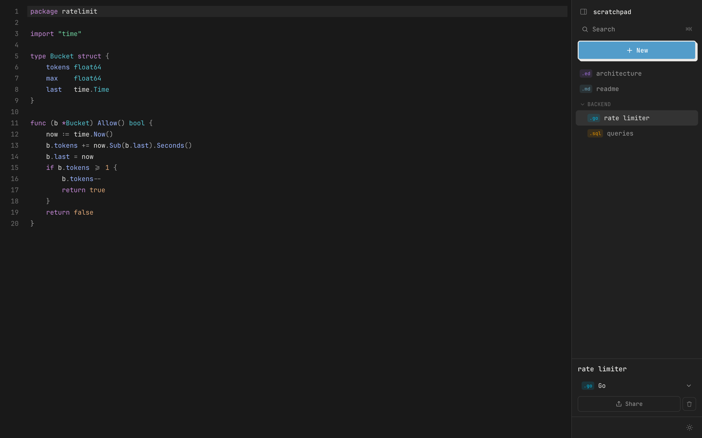
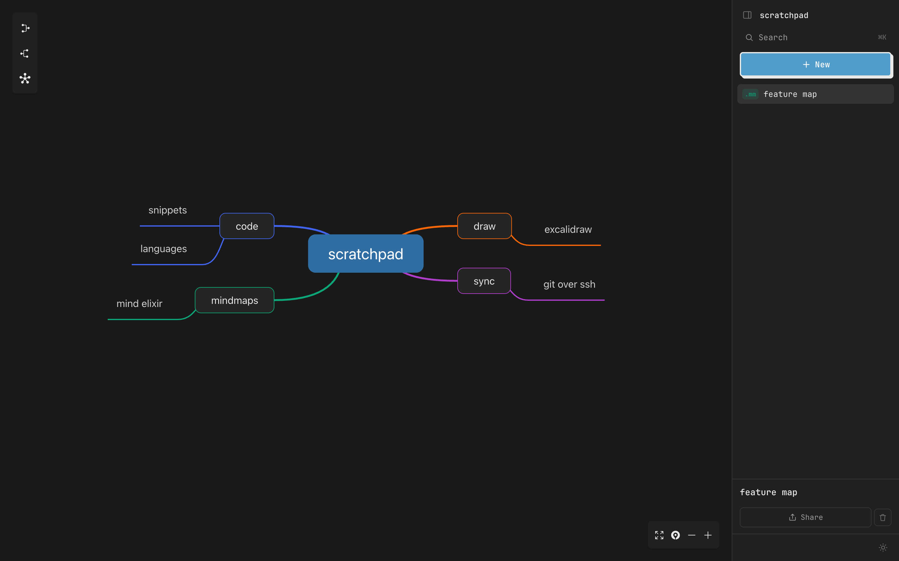
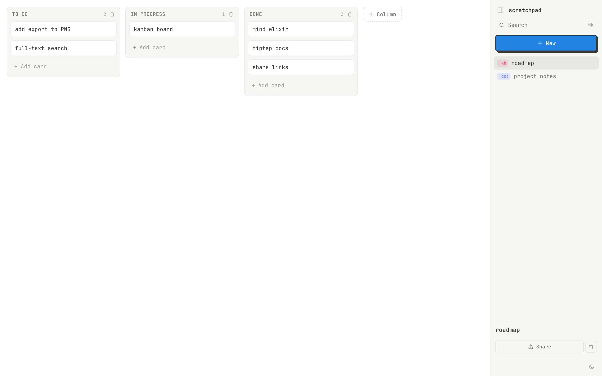
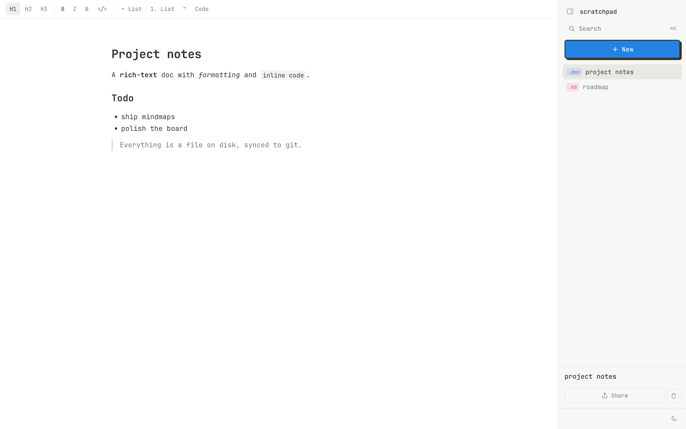
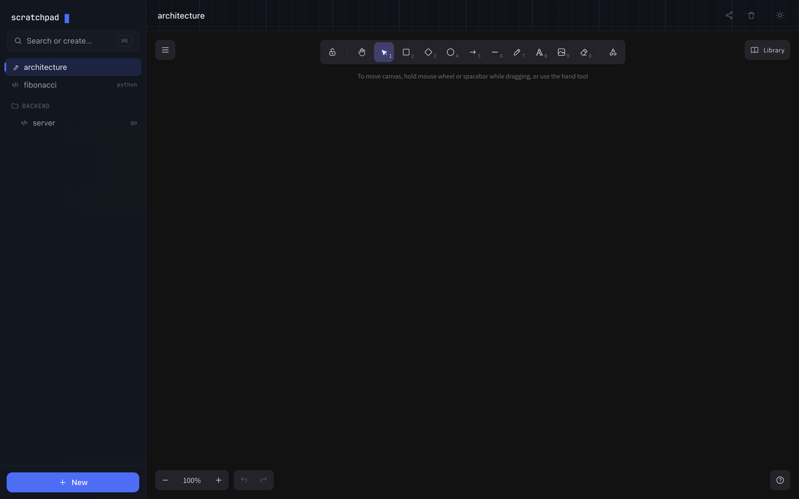

<h1 align="center">Scratchpad</h1>

<p align="center">
  A self-hosted workspace for code, diagrams, mindmaps, docs and boards —
  one small Go binary, light on RAM, synced to your own git repo.
</p>

<p align="center">
  <a href="https://github.com/phoenix911/scratchpad/actions/workflows/build.yml"></a>
  <a href="https://github.com/phoenix911/scratchpad/releases"></a>
  <a href="LICENSE"></a>
</p>

<p align="center"></p>

Scratchpad is a personal, single-user workspace you run on your own server. It's
a single Go binary that embeds a React app — no database server, no cloud, no
Docker required. Everything you create is a plain file on disk, synced to a
private git repository you control, and shareable via expiring view-only links.

## Features

- **Five editors, one app** — code snippets (CodeMirror), drawings (Excalidraw),
  mindmaps (Mind Elixir), rich-text docs (Tiptap) and kanban boards.
- **Files on disk, synced to git** — your data is a folder of real files pushed
  to your own private repo over SSH or HTTPS. Easy backup, easy recovery.
- **View-only share links** — share any item read-only, with optional expiry
  (1–30 days or never), plus auto-generated link-preview images.
- **Version history** — every item is git-tracked, so you can browse and restore
  any past version.
- **Backlinks** — `[[wiki-links]]` between items with a "linked from / links to"
  panel.
- **Paste images** into docs; they're stored alongside your data and served in
  shares.
- **Fast & light** — ~20–30 MB idle RAM, single static binary, instant boot.
- **Looks good** — clean monospace UI, light/dark following your system, a
  ⌘K command palette.

<p align="center">
  
  <br>
  
  
</p>

## Quick start

Grab a binary from [Releases](https://github.com/phoenix911/scratchpad/releases),
or build from source:

```bash
git clone https://github.com/phoenix911/scratchpad
cd scratchpad
make all          # builds the SPA, embeds it, produces ./scratchpad
./scratchpad      # serves on http://localhost:8080
```

That's it — open http://localhost:8080. With no `SCRATCHPAD_PASSWORD` set it runs
open (local only). To configure it, copy `.env.example` to `.env` and edit.

## Configuration

All settings come from environment variables (or a `.env` file; real env vars win).

| Variable | Default | Description |
|---|---|---|
| `PORT` | `8080` | Port to listen on |
| `BIND` | all | Bind address (set `127.0.0.1` behind a proxy) |
| `SCRATCHPAD_PASSWORD` | — | Single-password gate; blank = no auth |
| `SHARE_BASE_URL` | — | Public URL, used to build share links |
| `GIT_URL` | — | Data repo to sync to (`git@…` or `https://…`); blank = local only |
| `GIT_USER` / `GIT_PAT` | — | For HTTPS git sync |
| `GIT_AUTHOR_NAME` / `GIT_AUTHOR_EMAIL` | `scratchpad` | Commit identity for the data repo |
| `DATA_DIR` | `./data` | Where item files live (the git working tree) |
| `DB_PATH` | `./scratchpad.db` | SQLite index (rebuildable) |

See the [configuration docs](https://phoenix911.github.io/scratchpad/docs/configuration/) for details.

## Self-hosting

Run the binary directly behind any reverse proxy or tunnel — Caddy, nginx,
Cloudflare Tunnel or Tailscale — so your share links work from anywhere. A
sample systemd unit and the full walkthrough are in the
[deployment guide](https://phoenix911.github.io/scratchpad/docs/deployment/).

## Documentation

📖 **Full docs: <https://phoenix911.github.io/scratchpad/docs/>**

- [Getting started](https://phoenix911.github.io/scratchpad/docs/getting-started/)
- [Configuration](https://phoenix911.github.io/scratchpad/docs/configuration/)
- [Deployment](https://phoenix911.github.io/scratchpad/docs/deployment/)
- [Git sync](https://phoenix911.github.io/scratchpad/docs/git-sync/)
- [Architecture](https://phoenix911.github.io/scratchpad/docs/architecture/) · [Data model](https://phoenix911.github.io/scratchpad/docs/data-model/) · [HTTP API](https://phoenix911.github.io/scratchpad/docs/api/)
- [Item types](https://phoenix911.github.io/scratchpad/docs/item-types/)

## Contributing

Issues and PRs welcome — see [CONTRIBUTING.md](CONTRIBUTING.md) for the dev
setup, [CODE_OF_CONDUCT.md](CODE_OF_CONDUCT.md), and
[SECURITY.md](SECURITY.md) for reporting vulnerabilities.

Tech: Go (`net/http` + chi, pure-Go SQLite, shells out to `git` for sync)
embedding a Vite + React + TypeScript app.

## License

[MIT](LICENSE).
